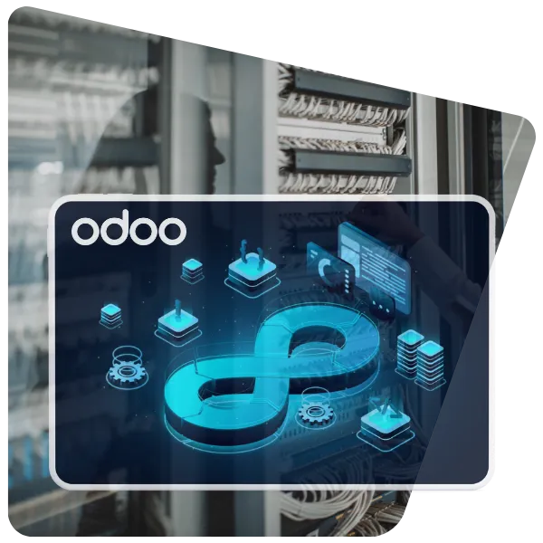

# **Solution d'hébergement Odoo par Akretion**

**Sécurité, performance et expertise au service de votre ERP**

---

# **Pourquoi l'hébergement est-il critique pour Odoo ?**

- **Disponibilité** : accès 24/7 à votre ERP
- **Sécurité** : protection de vos données sensibles
- **Performance** : temps de réponse optimaux
- **Maintenance** : mises à jour et sauvegardes automatiques
- **Conformité** : respect des réglementations (RGPD, etc.)

> *Un hébergement mal choisi = des risques opérationnels et financiers*

---

# **Akretion : une expertise unique**

## **Chiffres & Elements clés**
- **17 ans** d'expérience sur Odoo
- **95 % de nos clients** hébergés chez Akretion depuis 2010
- **20 experts** dédiés en France (Villeurbanne)
- **+120 clients** actifs, dont 20 grands comptes (85 % du CA)
- **Chiffre d'affaires 2025** : 1,8 M€
- Membre fondateur de l'**OCA** (Odoo Community Association)
- Partenariat avec **[Hexanode](https://hexanode.fr/)** pour l'infrastructure

---

# **Sécurité et conformité : notre ADN**

## **Expérience unique**
- **2015** : lauréat d'un appel d'offres du **ministère des Armées**
- **Audit de sécurité** mené par les services du ministère
- Exigences renforcées appliquées à **tous nos clients**

## **Mesures de sécurité**
✅ **Hébergement 100 % français** (souveraineté des données)
✅ **Mises à jour de sécurité** automatiques et accès contrôlés
✅ **Accès contrôlé et journalisé**

---

# **Infrastructure technique robuste**

## **Architecture**
- **Machines physiques** (minimum 3 serveurs)
- **VM dédiée** par client (isolation totale)
- **Base de données PostgreSQL** mutualisée et répliquée
- **SLA de 99,9 %** (disponibilité garantie)

## **Sauvegarde et résilience**
- **Sauvegardes continues** dans un datacenter distinct
- **Tests de restauration quotidiens** pour valider les sauvegardes
- **Réplication en temps réel** possible (option)

## **Environnements**
- **Production** : 10 Go de données, sauvegardes et tests illimités
- **Pré-production** : environnement de recette
- **Intégration continue** : VM dédiée aux tests

---

# **Services inclus et valeur ajoutée**

## **Inclus sans supplément**

| Service | Avantages |
|---------|-----------|
| **Tests de restauration** | Validation quotidienne de vos sauvegardes |
| **Vérification des vulnérabilités** | Sécurité proactive des librairies |
| **Mises à jour de sécurité** | Protection contre les failles |
| **Environnements de test illimités** | Développement et recette sans contrainte |
| **Surveillance 24/7** | Surveillance active de votre instance |
| **Support technique** | Intervention en moins de 2 heures (8h-18h) |

---

# **Flexibilité et évolutivité**

## **Options adaptables**
- ✅ **Ajout de workers** pour les charges lourdes
- ✅ **Espace disque supplémentaire** au-delà de 10 Go
- ✅ **Réplication en temps réel** pour une haute disponibilité

## **Migration facile**
- Reprise des données SQL depuis votre ancien hébergeur
- Accompagnement technique pour le transfert
- **Migration sans interruption** de service

---

# **Tarification transparente**
## **Offre standard & Engagement**
- **140 € par mois** (par instance)
- **2 workers** inclus
- **10 Go** de données de production
- **Sauvegardes et tests** illimités
- **Engagement minimal** : 6 mois, 1 mois de préavis seulement
- **Facturation semestrielle** en début de période
- **Remboursement** des mois non consommés en cas de résiliation

---
# **Comparaison avec les alternatives**

| Critère | Akretion | Hébergeur générique | Auto-hébergement |
|---------|----------|---------------------|-----------------|
| **Expertise Odoo** | ✅ Spécialiste depuis 17 ans | ❌ Générique | ❌ À votre charge |
| **Sécurité** | ✅ Tests de vulnérabilité | ⚠️ Basique | ❌ À gérer |
| **Sauvegardes** | ✅ Tests de restauration quotidiens | ⚠️ Sauvegardes simples | ❌ Risque d'oubli |
| **Support** | ✅ Intervention en moins de 2 heures | ⚠️ Ticket standard | ❌ À votre charge |
| **Localisation** | ✅ France (souveraineté) | ⚠️ Variable | ❌ À gérer |

---

# **Nos références clients**
## **Secteurs variés**
- **Industrie** : DualSun, Noukie's, Oskab, Four Tous
- **Santé** : BS Orth, Flau, Apiteau
- **Agroalimentaire** : Les Artisans de la Sauce, La Fabrique Givrée
- **Commerce** : Stores-Discount, Douze Cycles
## **Cas d'usage**
- **Ministère des Armées** (2015-2020) : gestion de données sensibles
- **Abilis** : fournisseur de rang 1 de la Défense
- **Actiwork / Uniaccess** : migration et hébergement dédié

---

# **Pourquoi choisir Akretion ?**

## **Arguments clés**

1. **Expertise Odoo** : maîtrise complète de l'ERP
2. **Sécurité prouvée** : validée par le ministère des Armées
3. **Services inclus** : tests de restauration, vérification des vulnérabilités, CI/CD
4. **Flexibilité** : adaptation à vos besoins spécifiques
5. **Proximité** : équipe française et support réactif
6. **Transparence** : tarification claire, sans frais cachés
7. **Engagement** : SLA de 99,9 %, intervention rapide

---

# **Conclusion et prochaines étapes**

## **Pourquoi choisir Akretion ?**
- ✅ **Sécurité** : validée par des institutions exigeantes
- ✅ **Expertise** : 17 ans d'expérience sur Odoo, contributeur majeur
- ✅ **Services** : tout inclus, sans supplément
- ✅ **Flexibilité** : adapté à vos besoins
- ✅ **Prix** : compétitifs et transparents

---
# **Des questions ?** 

### **Contactez-nous**

📞 **Téléphone** : +33 6 72 84 74 09
📧 **Email** : contact@akretion.com
🌐 **Site web** : [akretion.com/fr/services/hebergement-odoo](https://akretion.com/fr/services/hebergement-odoo)
📍 **Adresse** : Villeurbanne, France

**Sébastien Maurines-Valdivia**: Développeur Odoo / Expert Factur-X

*Présentation basée sur l'expertise d'Akretion en hébergement Odoo depuis 2010*

